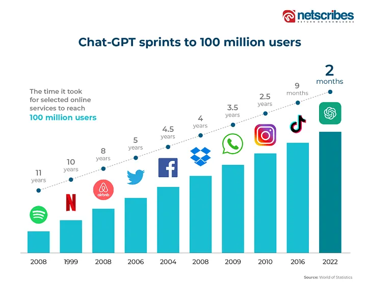
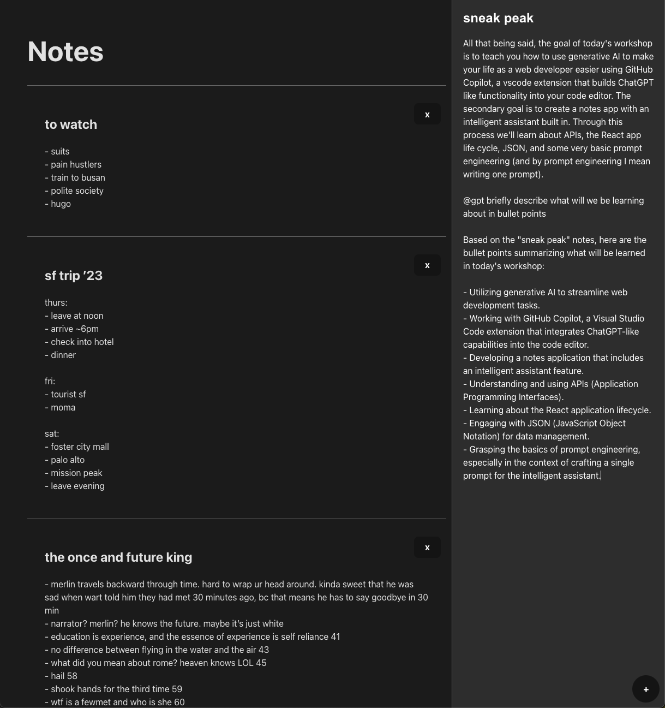
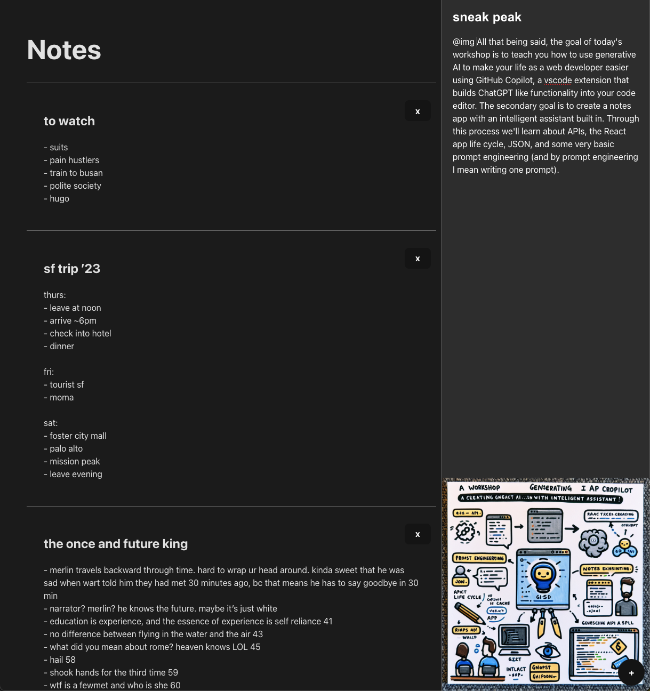
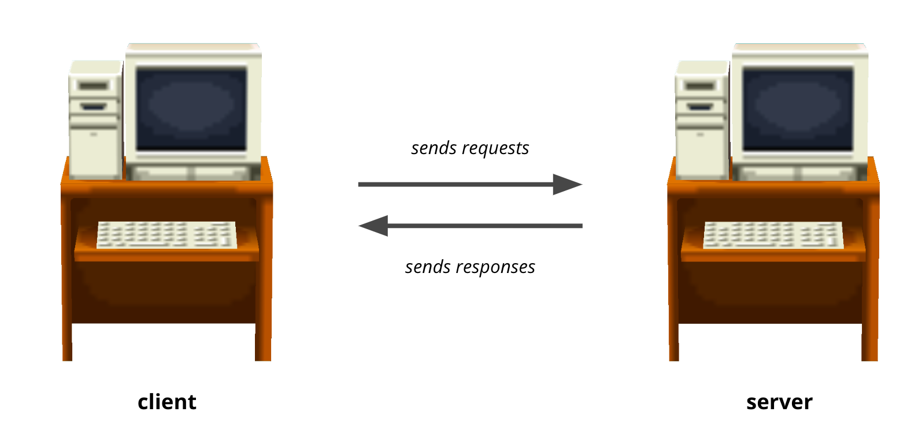

# Generative AI for Web Developers 💡

*or attempting to answer the question: are we all f\*cked*


*Generated by DALL-E 3 w/ the prompt "AI coming for web developer jobs."*

## Contents
- [Prelude](#prelude)
- [The State of AI](#the-state-of-ai)
- [Sneak Peek](#sneak-peek)
- [Why Generative AI?](#why-generative-ai)
- [Set Up](#set-up)
- [Review](#review)
- [What's On the Menu? (APIs)](#whats-on-the-menu)
- [Implementing @cat](#implementing-cat)
- [Implementing the AI Assistant](#implementing-the-ai-assistant)
- [Closing Remarks](#closing-remarks)

## Prelude

This workshop was presented as the sixth installment of Hackschool 2023, a workshop series offered by ACM Hack at UCLA. Its intended audience is those new to web development who may be be thinking about pursuing a career as a Software Engineer or Full Stack Developer or some other name for someone who codes for a living. Check out the slides for the workshop and our website below.

Slides: [Hackschool Session 6](https://tinyurl.com/hackschools6) <br>
Website: [hack.uclaacm.com](https://hack.uclaacm.com/) <br>

### Goals
1. Learn about **AI Driven Development**
2. Learn about APIs and Network Requests
3. Integrate an AI assistant into a simple notes app
4. Predict the future of Software Engineering?

*Disclaimer*: Particularly with regards to the future of Software Engineering, I do not know what I am talking about. I'm doing my best based on the information available to me, but it could very well be wrong. Do your own research! Without further ado, let's get started.


## The State of AI

Unless you've been living under a rock, you've probably heard of ChatGPT. It was released almost exactly a year ago now, and has since grown faster than (almost) any other product ever released, hitting 100 million users in just two months. 

 <br>

With its explosive growth has also come a lot of concern over how it might impact the world ten or twenty years down the line. So many people -- writers, artists, coders -- are scared they're going to be replaced. Recently we saw one of the longest writer's strikes ever in Hollywood, and one of their biggest demands was to disallow the use of generative AI by entertainment companies. Eventually the media agreed to this demand, but it's not clear how long they intend to uphold that promise. Beyond that, we've seen a lot of outrage from people who produce content: they claim their work is being stolen by companies like OpenAI to train their models.[^1] Yikes! 

[^1]: It's clear that OpenAI recognize this is an issue based on their recent announcement: Copyright Shield. They will step in and pay the legal fees of anyone sued for copyright infringement for using their models. My jaw actually dropped when I heard about this.

So it's a bit of a moral grey area. At least that's how it feels to me. That being said, I don't think its productive to just sit around and wait while our government catches up and starts regulating things. We might as well learn to use it to our advantage! 

It's worth noting that the current consensus is that generative AI is not going to replace software engineers anytime soon, though it will certainly automate away much of the tedium involved. ChatGPT and even GPT 4 seem very sophisticated from a surface level, but they have one huge flaw: they are incapable of synthesizing new ideas. If a program has never been written before (or it is not included in the training set), GPT 4 will be incapable of producing it. At the opposite side of the spectrum, if a program has been written countless times, but each of those times it has had a glaring security flaw, then GPT will continue to include that security flaw.[^2] The bottom line is this: human ingenuity is not being automated away quite yet. Fields that require creativity and innovation will continue to thrive. Fingers crossed.

[^2]: Credit to Philip Wadler, a designer of Haskell and theoretical computer scientist, in Carey Nachenberg's CS 131 for the take. 

## Sneak Peek

All that being said, the goal of today's workshop is to teach you how to use generative AI to make your life as a web developer easier using GitHub Copilot, a VSCode extension that builds ChatGPT like functionality into your code editor. The secondary goal is to create a notes app with an intelligent assistant built in. Through this process we'll learn about APIs, the React app life cycle, and some very basic prompt engineering (and by prompt engineering I mean writing one prompt).

Here's a look at the app we're going to build!




Notice the @gpt command on the right! We'll also be adding an @img command to allow users to generate images based on their notes. See below! 



Kinda cool, right? Let's get into it.

## Why GitHub Copilot?

You might be wondering, why should I as a web developer care about any of this? The bottom line is that it is going to remove a lot of the road blocks that people often hit as new developers, while also getting rid of a lot of the tedium that experienced engineers face! You won't have to look up obscure functions or quirky syntax any longer! It also makes reasoning about existing code much easier, as you can ask it to explain an existing code block or to generate unit tests or fix a bug. GitHub Copilot is also rapidly becoming the industry standard (though there are some significant holdouts), and GitHub claims that it leads to "55% faster coding." Pretty cool! 

This all sounds pretty great, but its important to note that the technology is not perfect. It makes a lot of mistakes, so its important to review any generated code for errors! 

## Set Up

First things first, let's get GitHub Copilot installed. You can do this on a number of text editors (including vim), but we're going to use VSCode. Normally Copilot is going to cost you a monthly subscription, but it comes for free if you have a student account. Here's how you can do that (if you haven't already):

1. Visit the student developer Pack main page (education.github.com/pack)
2. Sign Up for the student developer pack
3. Select Get Student Benefit
4. Sign-in or SignUp for a GitHub account.
5. Add your school email. This process usually needs some authentication, because a code will be sent to your school email for verification.
8. You might need to upload proof of attendance. Something like your bruincard works.
9. It might take a bit but you should hear back from them soon. I did it a while ago, but I think I got access the next day.

Now that you have your student account set up (or you've decided to shell out the subscription money), let's install the GitHub Copilot extension onto VSCode.

1. First, you need to activate Copilot from you GitHub account settings. Navigate to the settings page by clicking on your profile picture and clicking on settings in the drop down menu.
2. In the side bar, there should be a Copilot section. You can activate Copilot from this page.
3. Look up Copilot in the extension page in VSCode (which you can find in the left side bar, it looks like a couple squares being fit together) and install it, along with the chat extension.
4. You should see a new sidebar icon pop up. This means that Copilot is successfully installed!

To test it out, try asking it a question! 

## Review

Before we get going integrating our assistant into the notes app, let's do a quick review of some of the topics we covered last week. In particular, let's talk about servers, HTTP requests, and asynchronous programming (you'll see that all of this is going to be essential to building our demo today).

### Servers

The best way to think of a server (in my opinion), is as a black box. Essentially, you give it some input, it performs some computation behind the scenes, and it gives you some output. Pretty simple right? The key thing to note here is that you don't necessarily know what computation the server performs behind the scenes, and you don't care! As long as it does the thing you ask it to, you're happy. 

Any computer can be a server as long as it fulfills one important role: it listens for and **responds to requests** from other computers that we call **clients**. You can think of the interaction between a client and a server like the interaction between a customer and the staff at a restaurant. The customer requests some food and the staff prepares it and sends it to them. Similarly, the client computer requests some information or data and the server prepares it and sends it to them.



This brings up an important question: how do the client and server communicate? In the restaurant analogy, the customer can just use plain english and they'll (probably) be understood. Our client and our server also need a common language! That brings us to...

### HTTP 

HTTP is one example of a **protocol**, or a common language, between two computers. Basically, HTTP just defines a consistent way for clients and servers to communicate over the internet. There are a lot of details I'm glossing over here but the key components of HTTP that you should be aware of are the different request methods as well as hosts and endpoints.

#### Request Methods

Request methods are used to indicate what kind of action the client wants the server to perform. For example:

 - GET: indicates a request to *get* data
 - POST: indicates a request will update the state of the server and typically involves sending some data from the client
 - PUT: indicates a request will update some existing resource on the server
 - DELETE: indicates a request will *delete* a resource
 
 ...and there are many more.

#### Hosts and Endpoints

Together, the host and endpoint indicate where the client wants to direct an HTTP request. The host is the IP address of the server while the endpoint is looks like a path to a resource. An example host could be `localhost:8080` and an example endpoint is `GET /profile`. Once the HTTP request is directed to the right address and the server knows what the client wants from it, it can get started on the computation and send a response back!

## What's On the Menu?

Let's go back to our restaurant analogy. Our customer and staff now have a common language, but how does the customer know what they can order? They can't request just anything, because the kitchen might not have the ingredients or the chefs might not be familiar with the recipe. To deal with this issue the staff gives the customer a menu: a list of dishes they can order!

The client and the server have something similar called an API. The server's API serves an interface for the client. It lets the client know what functions it can perform, and it's defined through the server's endpoints.

### API Example

I've thrown together a basic little Express server (see last week's slides for a recap on Express) to illustrate all of these concepts in a more hands on way. You can find it in the `api-example` folder. 

In this Express app, I've defined a couple endpoints (which make up our API!):

- GET / 
- GET /fact
- GET /facts
- PUT /newfact:fact

Each of these endpoints serves as a point of interaction between a client and a server. Try it out for yourself! You can run the server using `node index.js` when in the `api-example` directory.[^3]

[^3]: The colon in the above PUT endpoint indicates an HTTP parameter. It allows us to pass information directly through the URL! 

### More Review: Asynchronous Programming

Now back to some review: asynchronous programming! Asynchronous programming is a powerful technique that allows us to execute code out of order rather than wait for the completion of each line. It's particularly useful when we make network requests, as we have no idea how long that request will take to be fulfilled (or if it will be fulfilled at all).[^4]

[^4]: Some of you may recall from last week that Javascript (both in the browser and in node) is single-threaded. You may be wondering then, how is asynchronous programming implemented? Don't we need multiple threads to prevent blocking? Actually, no. In Javascript, asynchronous programming is implemented via a clever trick called a  callback queue. If you're interested, check out [this](https://archive.ph/N6DUl) article for more information!

One option that Javascript provides for network requests is the `fetch` function, which just so happens to be an asynchronous function. 

```js
let res = fetch(serverURL) // fetch returns a promise!
```

The `fetch` function makes it really easy to make GET requests! All we have to do is pass in the URL of the server and the respective endpoint and it will return a promise representing the eventual fulfillment of that request. Remember that we could deal with this promise in one of two ways:

1. `.then`
2. async/await

For this workshop we're going to use async/await, but it's really up to personal preference whichever one you want to use. They both allow you to get values from within promises.

Let's try putting all of this into action! I want to add some functionality to our starter notes app: a new command called @cat that generates a random cat fact and adds it to the current note. We're going to use our cat facts API to accomplish this.[^5]

[^5]: It wouldn't be too difficult to just do this ourselves, but for the sake of learning let's use the API.

## Implementing @cat

First, it would probably be helpful to walk through the code. I'm not going to go through everything as there's not much of a point, but at the very least I'll show you `App.jsx`.

That's what I would say if we hadn't installed GitHub Copilot. Luckily, GitHub Copilot can explain the code for us! All we need to do is highlight all the code in `App.jsx` and run the /explain command. This is what it outputs for me:


>This JavaScript React code is for a simple note-taking application. The application allows users to create, view, and delete notes. The notes are stored in the local storage of the user's browser.
>
>The code starts by importing necessary dependencies and components. The useState and useEffect hooks from React are imported, which are used for managing state and side effects in the application. Two custom components, Note and NoteSubmitter, are also imported.
>
>The App function component is defined next. Inside this component, several pieces of state are declared using the useState hook: title and content for the current note being created, and notes for the list of all notes.
>
>Two handler functions, titleHandler and contentHandler, are defined. These functions update the title and content state respectively when the user types into the corresponding input fields.
>
>The submit function is defined to handle the submission of a new note. It first checks if the title or content is empty, and if so, it alerts the user and returns early. Otherwise, it creates a new note object, adds it to the list of notes, and updates the notes state. It then stores the updated list of notes in local storage and clears the title and content state.
>
>The deleteNote function is defined to handle the deletion of a note. It removes the note at the given index from the list of notes, updates the notes state, and updates the list of notes in local storage.
>
>The useEffect hook is used to load the list of notes from local storage when the component first renders. If there are any notes in local storage, it updates the notes state with these notes.
>
>Finally, the component returns a JSX element that renders the application. It displays a list of all notes, with each note rendered using the Note component. It also includes the NoteSubmitter component, which is used to create new notes. The handlers and state are passed as props to these components. The App component is then exported for use in other parts of the application.

Pretty cool, right? And, at least in this case, pretty accurate. You can imagine why /explain would be useful if you're working in an unfamiliar code base. Rather than having to read through the code and understand everything yourself, you can have Copilot explain it to you! If there's anything that's unclear about the explanation, you can ask it to clarify.

In my case, I want to add a new command: @cat. The way I want this to work is that if the string "@cat" is found within the title or content of a new note that is being submitted, I want a random cat fact from the Cat Facts API we made to be added to the note. 

1. The place that makes the most sense to add this functionality is within the `submit` function.
2. In particular, we should add a check before any of the other code is run that determines whether the substring is present.
3. If it is, we'll use `fetch` to submit an HTTP request to our server (which in this case will be running on http://localhost:8080). The endpoint we want to use is GET /fact (which returns a random fact from the list of facts).
4. Since, fetch returns a promise, we'll unwrap this promise using async/await.
5. After that, we can append our new fact to the note!

Let's try giving the above plan to Copilot and see what it comes up with! We can generate new code directly in our editor with the shortcut `CMD+I` on Mac (not sure what it is on Windows if I'm being honest, but my best guess is probably `Ctrl+I`). Here's the code it generated for me.

```js
  // submit note
  const submit = async () => {
    // prevent empty note
    if (title === '' || content === '') {
      alert("Cannot submit empty note!");
      return;
    }

    // check for cat fact
    let newContent = content;
    if (title.includes('@cat') || content.includes('@cat')) {
      const response = await fetch('http://localhost:8080/fact');
      const data = await response.json();
      newContent += `\n\nCat Fact: ${data.fact}`;
    }

    // add new note
    const newNote = {
      title: title,
      content: newContent
    }
    const newNotes = [newNote, ...notes]
    setNotes(newNotes);

    // write to local storage
    localStorage.setItem('notes', JSON.stringify(newNotes));

    // clear the form
    setTitle('');
    setContent('');
  }
```

Not quite what I was after, but it's a good start. Notice that it changed submit into an asynchronous function. It also added the cat fact logic, although it put it after the empty note prevention. I'm going to move the cat fact block up before this, and return after it finishes, that way the user can look at the cat fact that they generated before submitting their note.

After my changes, `submit` looks like this:

```js
const submit = async () => {
    // check for cat fact
    let newContent = content;
    if (title.includes('@cat') || content.includes('@cat')) {
      const response = await fetch('http://localhost:8080/fact');
      const data = await response.json(); // PROBLEM
      newContent += `\n\nCat Fact: ${data.fact}`; // PROBLEM
      return; // PROBLEM
    }

    // prevent empty note
    if (title === '' || content === '') {
      alert("Cannot submit empty note!");
      return;
    }

    // add new note
    const newNote = {
      title: title,
      content: newContent
    }
    const newNotes = [newNote, ...notes]
    setNotes(newNotes);

    // write to local storage
    localStorage.setItem('notes', JSON.stringify(newNotes));

    // clear the form
    setTitle('');
    setContent('');
  }
```

There's two more big problems with this code: 

1. Our endpoint returns plain text, not json (which I know since I read the API). We need to change `response.json()` to `response.text()`. Likewise, since data is not an object, we need to change `data.fact` to just `data`.
2. We're not updating content variable, so it's not going to show up in the content area. We need to add `setContent(newContent)` to the function.

I'm also going to add a simple quality of life change by making `newContent` equal to `content.trim()` (this removes trailing white space from content).

Here's the final `submit` function:
```js
const submit = async () => {
    // check for cat fact
    let newContent = content.trim();
    if (title.includes('@cat') || content.includes('@cat')) {
      const response = await fetch('http://localhost:8080/fact');
      const data = await response.text();
      newContent += `\n\nCat Fact: ${data}`;
      setContent(newContent);
      return;
    }

    // prevent empty note
    if (title === '' || content === '') {
      alert("Cannot submit empty note!");
      return;
    }

    // add new note
    const newNote = {
      title: title,
      content: newContent
    }
    const newNotes = [newNote, ...notes]
    setNotes(newNotes);

    // write to local storage
    localStorage.setItem('notes', JSON.stringify(newNotes));

    // clear the form
    setTitle('');
    setContent('');
  }
```

You can see Copilot made a lot of subtle mistakes in this case. This is why we always want to be sure to look over the code Copilot generates! But we've now sucessfully implemented our @cat command. Neat! 

## Implementing the AI Assistant

Now that we've gotten the warm up out of the way, we can go on to the exciting part of today's workshop: implementing the AI assistant. To do this, we're going to extend our apps commands to include:

1. @gpt: This will prompt our AI assistant to respond to whatever we've written in the current note
2. @img: This will prompt our AI assistant to generate an image based on the current note

To implement both of these features, we're going to take advantage of the OpenAI API. We'll see that this API is bit more involved than our Cat Facts API. OpenAI has also implemented a layer of abstraction over it via their own library, so we're going to install that. As a result, we're not going to have to manually call `fetch` or anything like that, but the principles remain the same. Let's get started.

> Note: OpenAI's API is not free. But for our purposes, it's very cheap, only costing a fraction of a cent per request. The image generation API is a bit more expensive. Prices vary by model with GPT 4 tending to cost more than GPT 3.5. More details on pricing can be found on OpenAI's website.

1. To start, we're going to want to make an OpenAI account (if you haven't already) [here](https://platform.openai.com/docs/overview). 
2. Load some money into the balance. I loaded in $10 a few weeks ago and that has been more than enough.
3. Generate an API key [here](https://platform.openai.com/api-keys). Make sure to copy it down somewhere.
4. Install OpenAI library with `npm install openai` and import it into `App.jsx`.
5. Initialize OpenAI object w/ API key (note: you should never hardcode your API key, but for simplicity we will).

```js
const [openai] = useState(new OpenAI({
  apiKey: import.meta.env.VITE_APP_OPENAI_API_KEY,
  dangerouslyAllowBrowser: true,
}));
const [systemPrompt, setSystemPrompt] = useState("");

```

6. Implement @gpt functionality[^6]. [This](https://platform.openai.com/docs/quickstart?context=node) page will be helpful to get you started. Can see the final code below:

```js
// check for @gpt command
let newContent = content.trim();
if (title.includes('@gpt') || content.includes('@gpt')) {
  const prompt = title + " " + content;

  setContent(newContent + `\n\nThinking...`);

  const response = await openai.chat.completions.create({
    model: "gpt-4-1106-preview",
    messages: [
      { role: "system", content: systemPrompt },
      { role: "user", content: prompt },
    ]
  });

  const data = response.choices[0].message.content;
  newContent += `\n\n${data}`;
  setTitle(title.replace("@gpt", ""));
  setContent(newContent.replace("@gpt", ""));
  return;
}
```

As a [reference](https://platform.openai.com/docs/api-reference/chat/object), the response object looks like the following:

```js
{
  "id": "chatcmpl-123",
  "object": "chat.completion",
  "created": 1677652288,
  "model": "gpt-3.5-turbo-0613",
  "system_fingerprint": "fp_44709d6fcb",
  "choices": [{
    "index": 0,
    "message": {
      "role": "assistant",
      "content": "\n\nHello there, how may I assist you today?",
    },
    "finish_reason": "stop"
  }],
  "usage": {
    "prompt_tokens": 9,
    "completion_tokens": 12,
    "total_tokens": 21
  }
}

```

7. We want the assistant to be able to read the user's notes. For simplicity, we'll just pass this information into the system prompt (which is where we define the role of the assistant). In reality, this is not a good way of doing this, but for the sake of the workshop and keeping things simple, it's what we're going to do. <br><br>We want to update the system prompt so that it reflects the contents of all of the user's notes. We this update to be performed every time a new note is added to the notes array. How can we accomplish this? Luckily, React has a built in function called `useEffect` that does just this!

```js
useEffect(action, dependencyArray)
```

In the above example, useEffect will call the `action` function whenever an item in the dependency array is modified! If the array is empty, then the action will only be called upon initial render of the app. 

Let's add the following code to update our prompt!

```js
 // initialize system prompt to include all notes
useEffect(() => {
  let prompt = "Answer questions based on the user's notes. You should always identify the notes where you got the information by title. If the user does not ask a question about the notes, then answer as an AI assistant. The notes are shown here: \n\n";
  
  notes.forEach((note) => {
    prompt += `(Title: ${note.title}\n\nContent:\n${note.content})\n\n`;
  });
  setSystemPrompt(prompt);
}, [notes]);
```

11. Now we can similarly implement @img (based on [this](https://platform.openai.com/docs/api-reference/images/create) documentation).

```js
// check for @img command
if (title.includes('@img') || content.includes('@img')) {
  const prompt = title + " " + content;

  setContent(newContent + `\n\nThinking...`);

  const response = await openai.images.generate({
    model: "dall-e-3",
    prompt: prompt,
  });

  setImage(response.data[0].url);

  // remove image command so that user can submit note with new image
  setTitle(title.replace("@img", ""));
  setContent(content.replace("@img", ""));
  return;
}
```
For reference, the response object looks like this (the urls are images):

```js
{
  "created": 1589478378,
  "data": [
    {
      "url": "https://..."
    },
    {
      "url": "https://..."
    }
  ]
}
```

12. cool beans

[^6]: While I was working on this workshop, OpenAI released a new API called the assistants API. I decided not to include it here, because it's still in beta, but keep in mind that that is likely going to be the preferred API in the future.

## Closing Remarks

